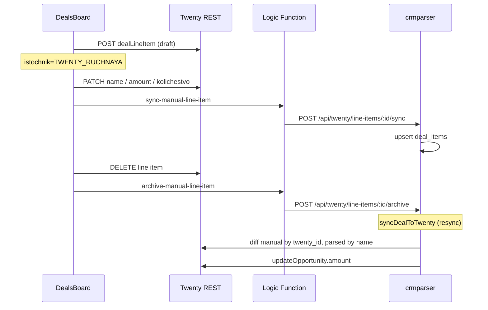

# Manual Twenty Line Items — Design Spec

**Date:** 2026-07-13  
**Status:** Approved  
**Repos:** `BrandingTwentyView`, `crmparserv2`

## Problem

Positions created with the «+» button in `BrandingTwentyView` exist only in Twenty CRM. They are not stored in crmparser `deal_items`. On the next deal resync, `computeLineItemDiff()` treats them as orphans (matched only by normalized name against parser-eligible items) and **deletes** them from Twenty when stage is `NOVYY`.

Operators need manual positions to:

1. Survive parser-driven resyncs.
2. Be stored in crmparser as first-class «manual» rows.
3. Coexist with parsed positions that share the same name (operator removes duplicates manually).
4. Contribute to `opportunity.amount` while active, and stop contributing after removal in Twenty.

## Goals

- Sync manual positions from Twenty → crmparser after the **first meaningful edit** (name, amount, or quantity).
- Keep manual rows in SQLite with `sync_override = include` while active.
- On delete in Twenty, soft-archive in parser (`sync_override = exclude`); row retained for history.
- After initial sync, **continuously mirror** name / amount / quantity from Twenty → parser.
- On resync, include active manual items in `opportunity.amount`; exclude archived items.
- Protect draft positions (created via «+», not yet synced) from resync deletion until first meaningful edit.

## Non-Goals

- Auto-merging manual and parsed positions with the same name.
- Mirroring line-item **stage** from Twenty into parser SQLite.
- Moving parser Settings or list management into Twenty.
- Replacing parser as source of truth for calendar/Tony parsed items.
- Bidirectional stage sync (parser → Twenty stage protection rules unchanged).

---

## Decisions Summary

| Question | Decision |
|----------|----------|
| Same name: manual + parsed | **Separate rows** — operator deletes unwanted duplicate |
| When to create parser row | After **first meaningful change** to name, amount, or quantity |
| Delete in Twenty | `sync_override = exclude` in parser; row kept |
| Ongoing Twenty edits | Always mirror **name / amount / quantity** to parser |
| `opportunity.amount` on resync | Include active manual items (`include`); exclude archived (`exclude`) |

**Meaningful change** (first sync trigger) — any of:

- `name !== 'Новая позиция'`
- `amount.amountMicros > 0`
- `kolichestvo` differs from the value stored at create time (baseline tracked client-side until first sync)

---

## Architecture

**Approach:** Push from deals board on edit + parser resync diff keyed by `twenty_id` for manual items (recommended over resync-only pull or Twenty workflows).



### Components

| Layer | Responsibility |
|-------|----------------|
| `BrandingTwentyView` | Set `istochnik` on create; detect meaningful change; call parser proxy on sync/archive |
| Logic functions | Proxy to crmparser `/api/twenty/*` (reuse `crmparser-proxy`) |
| `crmparserv2` API | Upsert / archive `deal_items` by `twenty_id` |
| `twenty-line-items-sync.js` | Diff manual items by `twenty_id`; parsed by normalized name; protect drafts |
| `twenty-opportunity.js` | `computeDealItemsTotal` unchanged — manual rows eligible via `sync_override=include` |

---

## Twenty Metadata

### New field on `dealLineItem`

| Property | Value |
|----------|--------|
| Name | `istochnik` |
| Type | SELECT |
| Options | `PARSER` (label: «Парсер»), `TWENTY_RUCHNAYA` (label: «Ручная (доска)») |
| Default on board create | `TWENTY_RUCHNAYA` |
| Default on parser sync create | `PARSER` |

Scaffold via `yarn twenty dev:add field` in `BrandingTwentyView`; stable UUID v4 assigned at scaffold time.

---

## Parser Data Model

### `deal_items` row — active manual position

| Column | Value |
|--------|--------|
| `classification` | `manual_twenty` (new value) |
| `sync_override` | `include` |
| `twenty_id` | Twenty `dealLineItem.id` |
| `name` | Mirrored from Twenty |
| `price` / `sum` | Derived from Twenty `amount` and `kolichestvo` |
| `quantity` / `quantity_num` | Mirrored from `kolichestvo` |

### Archived (deleted in Twenty)

| Column | Value |
|--------|--------|
| `sync_override` | `exclude` |
| `twenty_id` | Preserved |
| Other fields | Last snapshot before archive |

### Eligibility

Existing `getItemsForTwenty()` logic:

- `sync_override = include` → eligible → counts toward `computeDealItemsTotal`
- `sync_override = exclude` → not eligible → excluded from amount

`classification = manual_twenty` is informational; eligibility is driven by `sync_override`.

---

## Parser API

All routes under existing `/api/twenty` router with `twentyAppAuthMiddleware`.

### `POST /api/twenty/line-items/:twentyLineItemId/sync`

**Body:**

```json
{
  "opportunityId": "<uuid>",
  "name": "Баннер 3x6",
  "kolichestvo": 2,
  "amountMicros": 1500000000,
  "currencyCode": "RUB"
}
```

**Behaviour:**

1. Resolve `deals` row by `twenty_id = opportunityId`; 404 if missing.
2. Upsert `deal_items` where `twenty_id = :twentyLineItemId`.
3. On insert: set `classification = manual_twenty`, `sync_override = include`.
4. On update: refresh name / price / quantity / sum; keep `sync_override` unless archived.
5. Return `{ success: true, dealItemId }`.

Idempotent: repeated calls with same `twenty_id` update in place.

### `POST /api/twenty/line-items/:twentyLineItemId/archive`

**Behaviour:**

1. Find `deal_items` by `twenty_id`; 404 if missing.
2. Set `sync_override = exclude`.
3. Return `{ success: true }`.

Does not delete the Twenty line item (Twenty UI already removed it).

---

## Logic Functions (BrandingTwentyView)

| Route | Method | Proxies to |
|-------|--------|------------|
| `/crmparser/line-items/:lineItemId/sync` | POST | `/api/twenty/line-items/:id/sync` |
| `/crmparser/line-items/:lineItemId/archive` | POST | `/api/twenty/line-items/:id/archive` |

Reuse `crmparser-proxy` with internal URL fallback (`CRMPARSER_API_INTERNAL_URL`).

---

## Deals Board Behaviour

### Create (`+`)

1. `POST /rest/dealLineItems` with default payload (`Новая позиция`, `NOVYY`, `kolichestvo: 1`, `amount: 0`).
2. `PATCH` set `istochnik = TWENTY_RUCHNAYA`.
3. Store create-time baseline `{ name, kolichestvo, amountMicros }` in mutation context / ref for meaningful-change detection.
4. **Do not** call parser sync yet.

### Update (inline edit)

On successful `updateLineItem`:

1. If row has never been synced to parser:
   - If meaningful change → call `sync` proxy.
   - Else → skip parser.
2. If already synced (`syncedToParser` flag in query metadata or parser row exists):
   - Always call `sync` proxy with latest fields.

Track «synced» state via React Query meta or optimistic flag set after first successful sync response.

### Delete

When line item removed in Twenty (if board exposes delete — otherwise hook into record delete event / explicit UI):

- Call `archive` proxy before or after REST delete.

If delete is not available in board v1, document as follow-up; archive triggers when user sets exclude via future UI or when resync detects missing `twenty_id` in Twenty — **v1 requires explicit archive call on delete path in board**.

---

## Resync Diff (`computeLineItemDiff`)

### Matching rules

| Parser item type | Match key in Twenty |
|------------------|---------------------|
| `manual_twenty` with `twenty_id` | `twenty_id` (exact) |
| Parsed (all other eligible) | `normalizePattern(name)` |

### Delete rules (Twenty line items)

Delete a Twenty line item when **all** are true:

1. No parser manual row matches its `id` (`twenty_id`).
2. No parser parsed eligible name matches `normalizePattern(name)`.
3. Stage is deletable (`null` or `NOVYY`) per existing stage protection.
4. **Not** a draft: `istochnik !== TWENTY_RUCHNAYA` **OR** parser already has a row for this `twenty_id`.

Rule 4 protects «Новая позиция» drafts until first sync.

### Update / create on resync (parser → Twenty)

- Parsed items: existing name-based update/create.
- Manual items: update matched Twenty row by `twenty_id`; never create duplicate from name alone if `twenty_id` already linked.
- Manual items are **not** deleted on resync while `sync_override = include` and Twenty row exists.

### Duplicate names (decision B)

Parser may hold:

- `deal_items` id=1 `name=Баннер` `classification=keyword_match` `twenty_id=li-parsed`
- `deal_items` id=2 `name=Баннер` `classification=manual_twenty` `twenty_id=li-manual`

Twenty holds two line items. Diff pairs each independently; resync does not collapse them.

---

## Opportunity Amount

On `syncDealToTwenty` update branch:

- `buildOpportunityInput` uses `computeDealItemsTotal(deal, getItemsForTwenty(allItems))`.
- Active manual items (`include`) contribute.
- Archived manual items (`exclude`) do not.

No separate amount logic required beyond existing eligibility rules.

---

## Error Handling

| Failure | Board behaviour |
|---------|-----------------|
| Parser proxy unreachable | Show inline error (`!`); Twenty data saved; retry on next PATCH |
| Deal not in parser (`404`) | Message: сделка не синхронизирована с парсером |
| Sync succeeds, resync fails | Manual row safe in parser; next resync retries |

All proxy endpoints return JSON `{ error: string }` on failure.

---

## Testing

### crmparserv2 (unit)

- `computeLineItemDiff`: manual `twenty_id` pairing; duplicate names; draft protection; exclude omitted from eligible set.
- `sync` / `archive` API routes: upsert, idempotency, 404 cases.
- `getItemsForTwenty`: `manual_twenty` + `include` eligible; `exclude` not.

### BrandingTwentyView (unit)

- Meaningful-change detector (baseline vs edits).
- Create payload includes `istochnik` after patch.
- Sync/archive client calls logic function paths.

### Manual smoke

1. Create deal synced to parser.
2. Add position via «+» → survives bulk resync before edit.
3. Rename → appears in parser `deal_items`.
4. Resync → position remains; amount includes manual line.
5. Add parsed position with same name → two rows in Twenty.
6. Delete manual in Twenty → archived in parser; amount decreases on resync.

---

## Implementation Order

1. **crmparserv2:** `manual_twenty` classification; sync/archive API; diff by `twenty_id`.
2. **BrandingTwentyView:** `istochnik` field; logic function routes; board hooks.
3. **Deploy parser** then **app**; set `CRMPARSER_API_INTERNAL_URL` if Docker.

---

## Related Specs

- `crmparserv2/docs/superpowers/specs/2026-06-09-deal-resync-design.md` — line item diff baseline
- `crmparserv2/docs/superpowers/specs/2026-07-10-twenty-line-item-lists-design.md` — gear menu / list proxy
- `BrandingTwentyView/docs/superpowers/specs/2026-06-26-deals-board-twenty-app-design.md` — board overview
